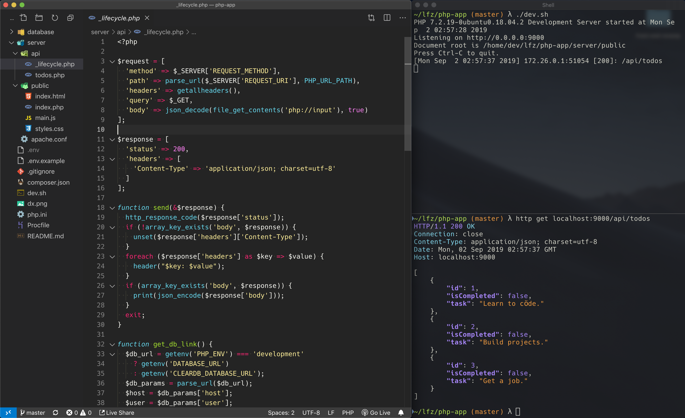

# php-app

A simple full stack application with a PHP JSON back end.

### Live Deployment

The app is deployed [on Heroku](https://php-app-example.herokuapp.com/).

### Requirements

1. PHP 7.2
1. MySQL 5.7
1. Bash

### Getting Started

1. Clone this repository.
    ```shell
    git clone https://github.com/thebearingedge/php-app && \
    cd php-app/
    ```
1. Copy `.env.example` to `.env`. Change variables if needed.
    ```shell
    cp .env.example .env
    ```
1. Create your MySQL database.
1. Import the MySQL dump file found in the `database/` directory.
1. Start the PHP server with the `dev.sh` script.
    ```shell
    ./dev.sh
    ```

### Development Screenshot

<p align="middle">
  
</p>
